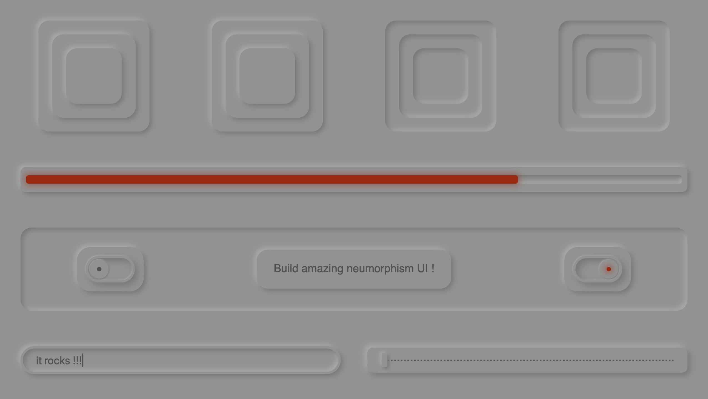

# Neumorphism React #

Neumorphism React is a React neumorphism components library designed to provide ready to use components following the neumorphism UI/UX trend.



## Documentation ##

You will find the full documentation and examples of the component library [here](https://zanchitheo.github.io/neumorphism-react/)

! Notice that the documentation is in building state so, some things may be missing !

The library is available on [npm](https://www.npmjs.com/package/neumorphism-react)

## Library installation ##

### Dependencies ###

Neumorphism React requires the installation of the `@emotion/core` and `@emotion/styled` packages:

```shell
npm install --save @emotion/core @emotion/styled

or

yarn add @emotion/core @emotion/styled
```

### Package installation ###

To install the Neumorphism React package, run the following command:

```shell
npm install --save neumorphism-react

or

yarn add neumorphism-react
```

## Contributing ##

The project repository is available [here](https://github.com/ZanchiTheo/neumorphism-react)

Pull requests are welcome. For major changes, please open an issue first to discuss what you would like to change.

Please make sure to update tests as appropriate.

### Tech stack ###

- `React`
- `styleguidist` for component visualization and documentation
- `emotion` for component styling
- `jest` for testing
- `eslint` for code linting
- `rollup` for bundling 

### Setup and launch the project ###

- Clone the project:
```shell
git clone https://github.com/ZanchiTheo/neumorphism-react.git
```
- Install dependencies:
```shell
yarn install
```
- Launch the styleguidist server:
```shell
yarn start
```
- Access the project at [localhost:6060](http://localhost:6060)

## License ##

[MIT](https://choosealicense.com/licenses/mit/)